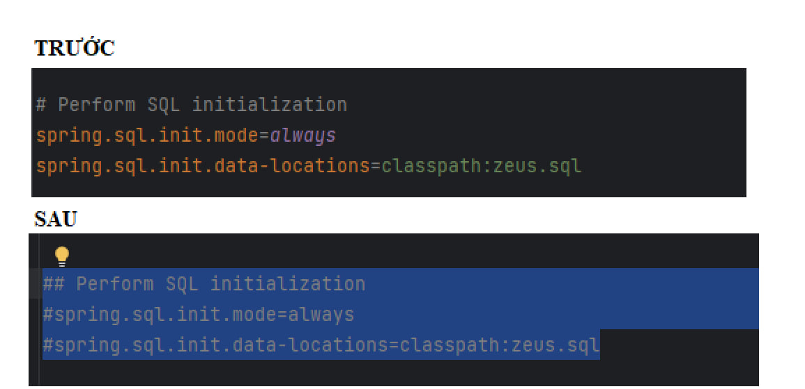

- PROJECT FOR JAVA 2023.

SET UP TO RUN PROJECT.

REQUIREMENTS BEFORE DOWNLOADING: 
- XAMPP
- JAVA / JDK  

Download the project locally:

git clone `https://github.com/nghiadaulau/zeus.git`

STEPS TO START PROJECT. 

STEP 1:
- Open your project in any JAVA IDE

STEP 2:
- Start your XAMPP.

STEP 3: VERY IMPORTANT !!!

START ADMIN MODULE IN FIRST RUN.
AT NEXT RUN. PLEASE GO FILE admin/src/main/resources/application.properties to remove the sql autogenerated line as shown in the following image:

IF YOU DO NOT FOLLOW THIS INSTRUCTION. THEN ON THE NEXT RUN IN THE ADMIN MODULE AN ERROR WILL EVEN.

START SNEAKER MODULE. CAN STARTED AT THE SAME TIME WITH ADMIN MODULE.

ACCESS
http://localhost:8020/admin/ to access the admin page  
THIS IS ADMIN INFORMATION.
> **Username:** nghiahln
>
> **Password:** 123456

ACCESS
http://localhost:8080 to go to USER's page